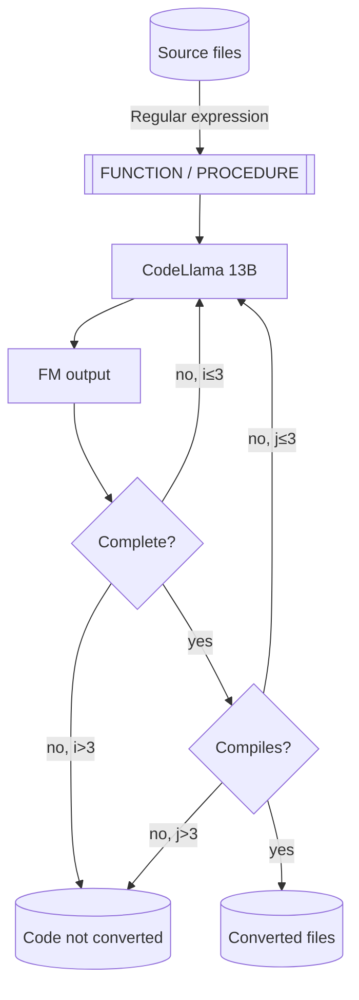

# Introduction

This repo contains a non-trivial but not production-ready example of using an Amazon SageMaker Endpoint running
[CodeLlama Instruct](https://aws.amazon.com/blogs/machine-learning/code-llama-code-generation-models-from-meta-are-now-available-via-amazon-sagemaker-jumpstart/)
to convert PL/SQL code to Python.

The code tries to handle the most common causes for error, including:

* Generic errors calling the endpoint (by retrying).
* Timeouts when calling the endpoint (by reducing the amount of output tokens in the request and retrying).
* Incomplete code translations (by iteratively passing the converted code chunk to the FM).
* Incorrect translated code (by making sure that the code compiles before saving it to disk or retrying, if needed).

# Index

[TOC]

# Running the code

## Cost considerations

This code will launch an Amazon SageMaker endpoint in a `ml.g5.12xlarge` instance. Please review the 
[AWS SageMaker pricing page](https://aws.amazon.com/sagemaker/pricing/?p=pm&c=sm&z=4) to understand the
cost implications of running it.

## Requirements

The code has been tested to work in Python 3.11, you will also need:

* The requirements in [`requirements.txt`](requirements.txt)
* AWS quota to launch a `ml.g5.12xlarge` instance as a SageMaker inference endpoint (configurable 
  [here](https://eu-west-1.console.aws.amazon.com/servicequotas/home/services/sagemaker/quotas/L-65C4BD00)).
* An AWS role with permission to create and invoke to SageMaker endpoints. Typically, SageMaker's default 
  execution role should work fine. When running in SageMaker, the default role will be specified, otherwise 
  you must supply it to the [`deploy_endpoint.py`](deploy_endpoint.py) script as an input argument.

## Running the code

### Deploying the endpoint

In order to convert the code, you should first deploy the SageMaker endpoint. If you run the script in
SageMaker, it should be able to deploy the endpoint correctly, otherwise you can pass the role name in
the command line.

```bash
# Deploy the endpoint using the default execution role
python deploy_endpoint.py
# Alternatively pass the desired role name in the command line, adapt to your
# default SageMaker execution role name
python deploy_endpoint.py --role-name=[AmazonSageMaker-ExecutionRole-YYYYMMDDTHHMMSS]
```

If everything is successful, you should see some example responses from the model after a few minutes.

### Executing the code conversion

Once you've deployed the endpoint, you can execute the code conversion script as follows:

```bash
python convert_code.py
```

This should start a somewhat lengthy process that will write the converted code to a `converted`
folder and the non-converted stored procedures to a `non-converted` folder in the current working 
directory.

## Errors

* If you get an `ValidationException` error when calling the `CreateModel` operation 
  (`botocore.exceptions.ClientError: An error occurred (ValidationException) when calling the CreateModel operation: The execution role ARN "arn:aws:iam::012345678901:role/Admin" is invalid. Please ensure that the role exists and that its trust relationship policy allows the action "sts:AssumeRole" for the service principal "sagemaker.amazonaws.com".`)
  please make sure that you execute the code inside SageMaker or to provide the name of the default SageMaker
  execution role in the command line, as the code is probably using the default CLI role.

# Execution flow

The code will process the input code using the flow below, which includes some of the error handling
strategies mentiones in the [introduction](#introduction).



# Useful resources

* [CodeLlama Jumpstart availability announcement](https://aws.amazon.com/blogs/machine-learning/code-llama-code-generation-models-from-meta-are-now-available-via-amazon-sagemaker-jumpstart/)
* [CodeLlama 70B Jumpstart availability announcement](https://aws.amazon.com/blogs/machine-learning/code-llama-70b-is-now-available-in-amazon-sagemaker-jumpstart/)
* [CodeLlama 13B Instruct in HuggingFace](https://huggingface.co/codellama/CodeLlama-13b-Instruct-hf)
