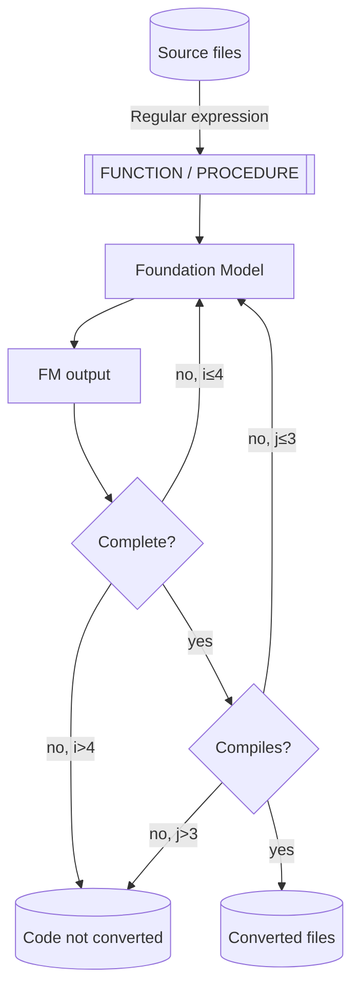

# Introduction

This repo contains a sample of using a FM for converting PL/SQL code to Python. The code is prepared to work with
Amazon Claude v3 in Amazon Bedrock (any of its variants) and an Amazon SageMaker Endpoint running
[CodeLlama Instruct](https://aws.amazon.com/blogs/machine-learning/code-llama-code-generation-models-from-meta-are-now-available-via-amazon-sagemaker-jumpstart/) (
sample deployment script can be found in
[`deploy_codellama_endpoint.py`](deploy_codellama_endpoint.py)).

The code tries to handle the most common causes for error, including:

* Generic errors calling the endpoint (by retrying).
* Timeouts when calling the endpoint (by reducing the amount of output tokens in the request and retrying).
* Incomplete code translations (by iteratively passing the converted code chunk to the FM).
* Incorrect translated code (by making sure that the code compiles before saving it to disk or retrying, if needed).

More details on the process used for conversion can be found [below](#execution-flow).

# Running the code

## Cost considerations

Please, consider the cost of running the example in your code. Amazon Bedrock pricing is detailed
[here](https://aws.amazon.com/bedrock/pricing/) and in case you want to use the Amazon SageMaker endpoint,
consider that the reference script [will deploy](#deploying-the-endpoint) an Amazon SageMaker endpoint in a
`ml.g5.12xlarge` instance. Please review
the [AWS SageMaker pricing page](https://aws.amazon.com/sagemaker/pricing/?p=pm&c=sm&z=4) to understand the full cost
implications before proceeding.

## Requirements

The code has been tested to work in Python 3.11, you will also need:

* The requirements in [`requirements.txt`](requirements.txt)
* If using CodeLlama Instruct for the code conversion:
    - A SageMaker endpoint running the FM or AWS quota to launch a `ml.g5.12xlarge` instance as a SageMaker inference
      endpoint.
    - An AWS role with permission to create and invoke to SageMaker endpoints. Typically, SageMaker's default
      execution role should work fine. When running in SageMaker, the default role will be specified, otherwise
      you must supply it to the [`deploy_endpoint.py`](deploy_endpoint.py) script as an input argument.

### Deploying the SageMaker endpoint

You can use [`deploy_codellama_endpoint.py`](deploy_codellama_endpoint.py) to deploy CodeLlama Instruct 13B
with default options (check the script for details). If you run the script in SageMaker, it should be able
to deploy the endpoint correctly, otherwise you can pass the role name in the command line.

```bash
# Deploy the endpoint using the default execution role
python deploy_endpoint.py
# Alternatively pass the desired role name in the command line, adapt to your
# default SageMaker execution role name
python deploy_endpoint.py --role-name=[AmazonSageMaker-ExecutionRole-YYYYMMDDTHHMMSS] --accept-license
```

If everything is successful, you should see some example responses from the model after a few minutes.

## Code requirements

The code is translated one stored procedure at a time, and those are separated using a heuristics process,
For this heuristic code to work, make sure that the `PROCEDURE`, `FUNCTION` & `END;` instructions are placed
at the start of the line, with no added spaces before them.

## Executing the code conversion

Once you've deployed the endpoint, you can execute the code conversion script. Here are some examples:

```bash
# Convert the code in the `scripts` folder using Claude v3 Haiku in Amazon Bedrock
python convert_code.py bedrock --model_id=anthropic.claude-3-haiku-20240307-v1:0
# Convert the code in the `scripts` folder using Claude v3 Sonnet in Amazon Bedrock
python convert_code.py bedrock --model_id=anthropic.claude-3-sonnet-20240229-v1:0
# Convert the code in the `scripts` folder with a SageMaker endpoint provided its name
python convert_code.py sagemaker --endpoint=codellama-13b
# Convert the code in a user-specified folder using Claude v3 Haiku in Amazon Bedrock
python convert_code.py --sources_dir=[PATH_TO_YOUR_SOURCES_DIR] bedrock --model_id=anthropic.claude-3-haiku-20240307-v1:0
# Convert the code in a user-specified folder using Claude v3 Sonnet in Amazon Bedrock
python convert_code.py --sources_dir=[PATH_TO_YOUR_SOURCES_DIR] bedrock --model_id=anthropic.claude-3-sonnet-20240229-v1:0
# Convert the code in a user-specified folder with a SageMaker endpoint provided its name
python convert_code.py --sources_dir=[PATH_TO_YOUR_SOURCES_DIR] sagemaker --endpoint=codellama-13b
```

This should start a somewhat lengthy process that will write the converted code to a `converted/[MODEL_ID]`
folder and the non-converted stored procedures to a `non-converted/[MODEL_ID]` folder inside the scripts folder.

## Errors

* If you get an `ValidationException` error when calling the `CreateModel` operation
  (`botocore.exceptions.ClientError: An error occurred (ValidationException) when calling the CreateModel operation: The execution role ARN "arn:aws:iam::012345678901:role/Admin" is invalid. Please ensure that the role exists and that its trust relationship policy allows the action "sts:AssumeRole" for the service principal "sagemaker.amazonaws.com".`)
  please make sure that you execute the code inside SageMaker or to provide the name of the default SageMaker
  execution role in the command line, as the code is probably using the default CLI role.

# Execution flow

The code will process the input code using the flow below, which includes some of the error handling
strategies mentiones in the [introduction](#introduction).

The code will look for `.pkb` files in the [`scripts`](scripts) folder and apply heuristics to extract
individual stored procedures or functions from the code and will try to convert them one by one using
the flow described below. Also, the whole process will be retried up to three times per stored procedure
in case of error (this is not depicted in the diagram below for clarity).



Converted code will be stored in the `scripts/[MODEL_ID]/converted` folder, whereas non-converted stored procedures
will be written to `scripts/[MODEL_ID]/non-converted` for tracking purposes.

# Results

The conversion code has been tested with the examples in [`scripts`](scripts) and with internal code. As a general rule:

* Claude models on Bedrock tend to operate better on very long code, being able to produce longer chunks
  before needing to iterate with more code chunk.
* Simple (yet non-trivial) code tends to yield good translations that follow the original code's intended purpose
  and inner working.
* Medium-complexity code typically is translated in a way that follows the original intent, but lacks specific
  details regarding corner case handling and/or specific logical code branches.
* Complex code that includes advanced use or cursors or very long bodies yield poorer performance, with code not
  being converted or the converted code lacking many details from the original code. Bigger Claude 3 variants
  appear to perform better for these cases, but manual review/conversion is required.

With that said, you'll see differences in the code style is different between the models, with some examples showing
that CodeLlama would convert some stored procedure local variables into function parameters whereas Claude might
correctly add them as function variables.

Also, Sonnet appears to provide more correct outputs (pending testing with Opus). Consider the following block of
code from [`pck_chinook_reports.pkb`](scripts/pck_chinook_reports.pkb):

```oraclesqlplus
PROCEDURE GET_ARTIST_BY_ALBUM(P_ARTIST_ID ALBUM.TITLE%TYPE)
IS
V_ARTIST_NAME ARTIST.NAME%TYPE;
BEGIN
    SELECT ART.NAME
    INTO V_ARTIST_NAME
    FROM ALBUM ALB
             JOIN ARTIST ART USING (ARTISTID)
    WHERE ALB.TITLE = P_ARTIST_ID;
    DBMS_OUTPUT
        .
        PUT_LINE
    ('ArtistName: ' || V_ARTIST_NAME);
END;
```

This procedure accepts an input parameter named `P_ARTIST_ID` which actually is the album title whose artist
name you want to retrieve. Both CodeLlama and Claude3 Haiku will respect that, but Sonnet actually renames the
variable so that it makes sense:

```python
def GET_ARTIST_BY_ALBUM(db_conn, p_album_title):
    with db_conn.cursor() as cursor:
        query = """
            SELECT ART.NAME
            FROM ALBUM ALB
            JOIN ARTIST ART USING (ARTISTID)
            WHERE ALB.TITLE = :album_title
        """
        cursor.execute(query, album_title=p_album_title)
        result = cursor.fetchone()

        if result:
            v_artist_name = result[0]
            print(f"ArtistName: {v_artist_name}")
        else:
            print("No artist found for the given album title.")
```

Also, Sonnet seems to exhibit a deeper knowledge of Oracle PL/SQL error codes. Think of the following pseudo-code
representing a situation found with some internal code:

```oraclesqlplus
CREATE PROCEDURE TEST
IS
BEGIN
INSERT INTO TABLE (COLUMNS) VALUES (ACTUAL_VALUES);
EXCEPTION
  WHEN DUP_VAL_ON_INDEX
  THEN
     DO_SOME_THINGS();
  WHEN OTHERS
  THEN
     LOG_ERROR();
End;
```

While Haiku & CodeLlama Instruct 13B will handle all `IntegrityError`s, Sonnet is actually handling the 
[`ORA-00001`](https://docs.oracle.com/en/error-help/db/ora-00001/) message separately from the rest of
errors one might get:

```python
def test(db_conn):
    try:
        cursor = db_conn.cursor()
        sql = """
            INSERT INTO TABLE (COLUMNS)
            VALUES (:1)
        """
        cursor.execute(sql, actual_values)
        db_conn.commit()
    except cx_Oracle.IntegrityError as e:
        if e.args[0].code == 1:  # DUP_VAL_ON_INDEX
            do_some_things()
        else:
            log_error()
```

## PCK_CHINOOK_REPORTS

[`pck_chinook_reports.pkb`](scripts/pck_chinook_reports.pkb) contains some sample PL/SQL stored procedures that have
been translated with this code and left as an example. You can check the results for the different examples
in the [`converted`](scripts/converted) folder, and you can test your own code by adding your own pkb files
to the [`scripts`](scripts) folder and running the code as described [above](#executing-the-code-conversion).

# Cleanup instructions

If you deployed the SageMaker endpoint, you can remove it as follows:

```bash
# Replace the endpoint name if you specified a custom one
aws sagemaker delete-endpoint --endpoint-name codellama-13b
aws sagemaker delete-endpoint-config --endpoint-config-name codellama-13b
```

# Useful resources

* [Access to the most powerful Anthropic AI models begins today on Amazon Bedrock](https://www.aboutamazon.com/news/aws/amazon-bedrock-anthropic-ai-claude-3)
* [CodeLlama Jumpstart availability announcement](https://aws.amazon.com/blogs/machine-learning/code-llama-code-generation-models-from-meta-are-now-available-via-amazon-sagemaker-jumpstart/)
* [CodeLlama 70B Jumpstart availability announcement](https://aws.amazon.com/blogs/machine-learning/code-llama-70b-is-now-available-in-amazon-sagemaker-jumpstart/)
* [CodeLlama 13B Instruct in HuggingFace](https://huggingface.co/codellama/CodeLlama-13b-Instruct-hf)
