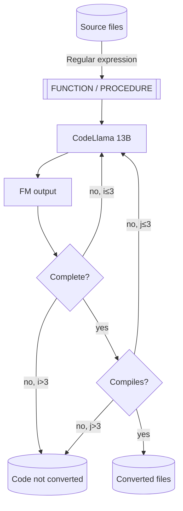

# Introduction

This repo contains a sample of using an Amazon SageMaker Endpoint running
[CodeLlama Instruct](https://aws.amazon.com/blogs/machine-learning/code-llama-code-generation-models-from-meta-are-now-available-via-amazon-sagemaker-jumpstart/)
to convert PL/SQL code to Python.

The code tries to handle the most common causes for error, including:

* Generic errors calling the endpoint (by retrying).
* Timeouts when calling the endpoint (by reducing the amount of output tokens in the request and retrying).
* Incomplete code translations (by iteratively passing the converted code chunk to the FM).
* Incorrect translated code (by making sure that the code compiles before saving it to disk or retrying, if needed).

# Running the code

## Cost considerations

Please, consider the cost of running the Amazon SageMaker endpoint before running the code. The reference script
[will deploy](#deploying-the-endpoint) an Amazon SageMaker endpoint in a `ml.g5.12xlarge` instance. Please review the 
[AWS SageMaker pricing page](https://aws.amazon.com/sagemaker/pricing/?p=pm&c=sm&z=4) to understand the
full cost implications before proceeding.

## Requirements

The code has been tested to work in Python 3.11, you will also need:

* The requirements in [`requirements.txt`](requirements.txt)
* A SageMaker endpoint running CodeLlama Instruct or, optionally, AWS quota to launch a `ml.g5.12xlarge` 
  instance as a SageMaker inference endpoint (configurable 
  [here](https://eu-west-1.console.aws.amazon.com/servicequotas/home/services/sagemaker/quotas/L-65C4BD00)).
* An AWS role with permission to create and invoke to SageMaker endpoints. Typically, SageMaker's default 
  execution role should work fine. When running in SageMaker, the default role will be specified, otherwise 
  you must supply it to the [`deploy_endpoint.py`](deploy_endpoint.py) script as an input argument.

## Code requirements

The code is translated one stored procedure at a time, and those are separated using a heuristics process,
For this heuristic code to work, make sure that the `PROCEDURE`, `FUNCTION` & `END;` instructions are placed
at the start of the line, with no added spaces before them.

## Running the code

In order to convert the code, you will need a SageMaker endpoint with CodeLlama Instruct already deployed.
Sample code that deploys CodeLlama Instruct 13B is provided for convenience in 
[`deploy_endpoint.py`](deploy_endpoint.py). You can find deployment instructions below.

### Deploying the endpoint

If you run the script in SageMaker, it should be able to deploy the endpoint correctly, otherwise you can 
pass the role name in the command line.

```bash
# Deploy the endpoint using the default execution role
python deploy_endpoint.py
# Alternatively pass the desired role name in the command line, adapt to your
# default SageMaker execution role name
python deploy_endpoint.py --role-name=[AmazonSageMaker-ExecutionRole-YYYYMMDDTHHMMSS]
```

If everything is successful, you should see some example responses from the model after a few minutes.

### Executing the code conversion

Once you've deployed the endpoint, you can execute the code conversion script as follows:

```bash
python convert_code.py
```

This should start a somewhat lengthy process that will write the converted code to a `converted`
folder and the non-converted stored procedures to a `non-converted` folder in the current working 
directory.

## Errors

* If you get an `ValidationException` error when calling the `CreateModel` operation 
  (`botocore.exceptions.ClientError: An error occurred (ValidationException) when calling the CreateModel operation: The execution role ARN "arn:aws:iam::012345678901:role/Admin" is invalid. Please ensure that the role exists and that its trust relationship policy allows the action "sts:AssumeRole" for the service principal "sagemaker.amazonaws.com".`)
  please make sure that you execute the code inside SageMaker or to provide the name of the default SageMaker
  execution role in the command line, as the code is probably using the default CLI role.

# Execution flow

The code will process the input code using the flow below, which includes some of the error handling
strategies mentiones in the [introduction](#introduction).

The code will look for `.pkb` files in the [`scripts`](scripts) folder and apply heuristics to extract
individual stored procedures or functions from the code and will try to convert them one by one using
the flow described below.



Converted code will be stored in the `scripts/converted` folder, whereas non-converted stored procedures
will be written to `scripts/non-converted` for tracking purposes.

# Results

Results based on real-world production code using CodeLlama Instruct 13B show the following qualitative results:

* Simple (yet non-trivial) code tends to yield good translations that follow the original code's intended purpose
  and workings.
* Medium-complexity code typically is translated in a way that follows the original intent, but lacks specific
  details regarding corner case handling and/or specific logical code branches.
* Complex code that includes advanced use or cursors or very long bodies yield poorer performance, with code not
  being converted or the converted code lacking many details from the original code 
  (because of input/output token length limit that requires many iterations).

It is yet to be seen whether bigger variants of the model (34B or 70B) or other/newer models such as Mixtral/Claude v3
as found in Amazon Bedrock might yield better performance for these cases.

## PCK_CHINOOK_REPORTS

[`pck_chinook_reports.pkb`](scripts/pck_chinook_reports.pkb) contains some sample PL/SQL stored procedures that have
been translated with this code and left as an example. You can check the results below.

Results are presented directly as converted by the model, with only minor cosmetic changes for readability 
(the unmodified output can be found in [`pck_chinook_reports.py`](scripts/converted/pck_chinook_reports.py)).

### GET_ARTIST_BY_ALBUM

PL/SQL code:

```oraclesqlplus
PROCEDURE GET_ARTIST_BY_ALBUM(P_ARTIST_ID ALBUM.TITLE%TYPE)
IS
V_ARTIST_NAME ARTIST.NAME%TYPE;
BEGIN
SELECT ART.NAME
INTO V_ARTIST_NAME
FROM ALBUM ALB
         JOIN ARTIST ART USING (ARTISTID)
WHERE ALB.TITLE = P_ARTIST_ID;
DBMS_OUTPUT
.
PUT_LINE
('ArtistName: '||V_ARTIST_NAME);
END;
```

Converted python code:

```python
import cx_Oracle

def get_artist_by_album(p_artist_id, connection):
    cursor = connection.cursor()
    query = "SELECT ART.NAME FROM ALBUM ALB JOIN ARTIST ART USING (ARTISTID) WHERE ALB.TITLE = :p_artist_id"
    cursor.execute(query, {"p_artist_id": p_artist_id})
    artist_name = cursor.fetchone()[0]
    print(f"ArtistName: {artist_name}")
```

### CUST_INVOICE_BY_YEAR_ANALYZE

PL/SQL code:

```oraclesqlplus
PROCEDURE CUST_INVOICE_BY_YEAR_ANALYZE
AS
V_CUST_GENRES VARCHAR2(200);
BEGIN
FOR V IN(SELECT CUSTOMERID, CUSTNAME, LOW_YEAR, HIGH_YEAR, CUST_AVG FROM TMP_CUST_
INVOICE_ANALYSE)
LOOP
IF SUBSTR(V.LOW_YEAR, -4) > SUBSTR(V.HIGH_YEAR , -4) THEN
SELECT LISTAGG(GENRE, ',') WITHIN GROUP (ORDER BY GENRE) INTO V_CUST_GENRES FROM
(SELECT DISTINCT
FUNC_GENRE_BY_ID(TRC.GENREID) AS GENRE
FROM TMP_CUST_INVOICE_ANALYSE TMPTBL JOIN INVOICE INV USING(CUSTOMERID)
JOIN INVOICELINE INVLIN
ON INV.INVOICEID = INVLIN.INVOICEID
JOIN TRACK TRC
ON TRC.TRACKID = INVLIN.TRACKID
WHERE CUSTOMERID=V.CUSTOMERID);
DBMS_OUTPUT.PUT_LINE('Customer: '||UPPER(V.CUSTNAME)||' - Offer a Discount According
To Preferred Genres: '||UPPER(V_CUST_GENRES));
END IF;
END LOOP;
END;
END;
```

Converted python code:

```python
import cx_Oracle

def cust_invoice_by_year_analyze(connection):
    cursor = connection.cursor()
    cursor.execute("SELECT CUSTOMERID, CUSTNAME, LOW_YEAR, HIGH_YEAR, CUST_AVG FROM TMP_CUST_INVOICE_ANALYSE")
    rows = cursor.fetchall()
    for row in rows:
        if int(row[2]) > int(row[3]):
            cursor.execute("SELECT LISTAGG(GENRE, ',') WITHIN GROUP (ORDER BY GENRE) FROM (SELECT DISTINCT FUNC_GENRE_BY_ID(TRC.GENREID) AS GENRE FROM TMP_CUST_INVOICE_ANALYSE TMPTBL JOIN INVOICE INV USING(CUSTOMERID) JOIN INVOICELINE INVLIN ON INV.INVOICEID = INVLIN.INVOICEID JOIN TRACK TRC ON TRC.TRACKID = INVLIN.TRACKID WHERE CUSTOMERID=:CUSTOMERID)", {"CUSTOMERID": row[0]})
            genres = cursor.fetchone()[0]
            print("Customer: " + row[1].upper() + " - Offer a Discount According To Preferred Genres: " + genres.upper())

```

# Useful resources

* [CodeLlama Jumpstart availability announcement](https://aws.amazon.com/blogs/machine-learning/code-llama-code-generation-models-from-meta-are-now-available-via-amazon-sagemaker-jumpstart/)
* [CodeLlama 70B Jumpstart availability announcement](https://aws.amazon.com/blogs/machine-learning/code-llama-70b-is-now-available-in-amazon-sagemaker-jumpstart/)
* [CodeLlama 13B Instruct in HuggingFace](https://huggingface.co/codellama/CodeLlama-13b-Instruct-hf)
